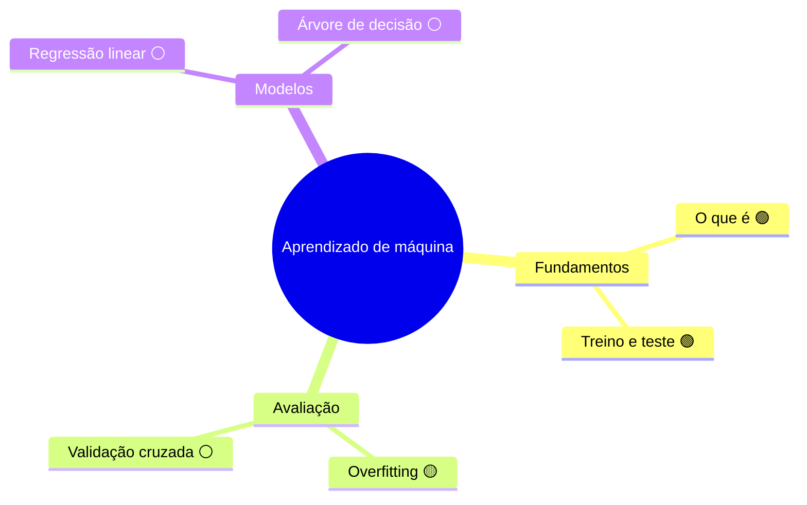
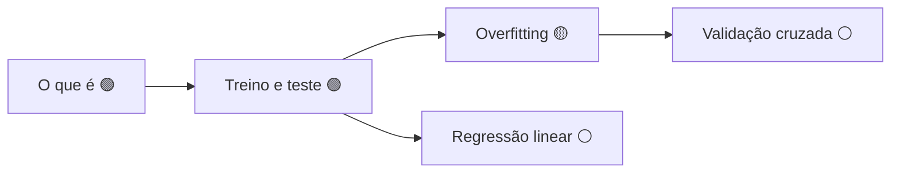

# Mapa mental: <assunto>

Gerado a partir de `grafo.md` em <AAAA-MM-DD>. Não edite este arquivo na mão: edite o grafo e
regenere, senão os dois divergem e o grafo deixa de ser a verdade.

O GitHub renderiza Mermaid sozinho, sem instalar nada.

## Hierarquia, com o domínio de cada conceito

## Pré-requisitos, que é o que o mindmap não mostra

O segundo diagrama é o que revela lacuna. Se um nó ⚪ está no caminho entre dois 🟢, ele é
buraco no meio da estrada e deve ser o próximo estudado.
